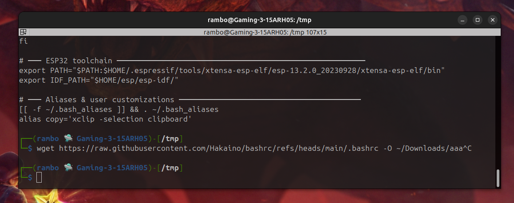
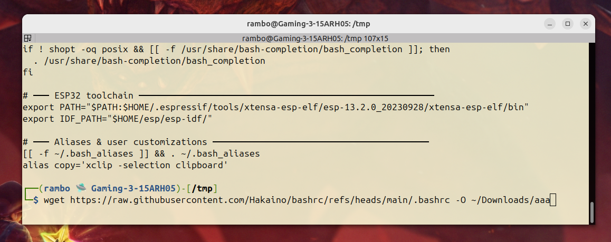

# Linux Utils
I started this to save my **.bashrc** and copy it to other computers whenever I needit.
I thought that others might like it so now, it is public :)
P.S.: Feel free to add relevant stuff :)

## bashrc
The ~/.bashrc is a config file for the terminal.
If you want my custume one, open terminal (**CTRL+ALT+T**) and type the command.
```
mv ~/.bashrc ~/.bashrc_backup
wget https://raw.githubusercontent.com/Hakaino/bashrc/refs/heads/main/.bashrc -O ~/.bashrc 
```

 
